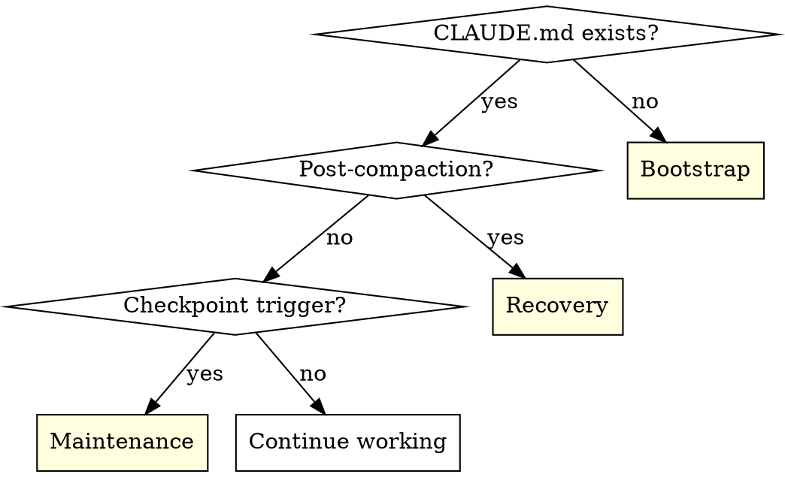

# Project Context Management Skill — Implementation Plan

> **For Claude:** REQUIRED SUB-SKILL: Use superpowers:executing-plans to implement this plan task-by-task.

**Goal:** Create a personal Claude Code skill that manages CLAUDE.md and `.claude/context/` files across bootstrap, maintenance, and recovery modes.

**Architecture:** Two-file skill — SKILL.md (modes + discipline) and templates.md (file templates) — at `~/.claude/skills/project-context-management/`. Personal skill, not project-specific. Not git-tracked.

**Tech Stack:** Claude Code skill (YAML frontmatter + markdown). No runtime code.

**Design doc:** `docs/plans/2026-03-03-project-context-management-skill-design.md`

**Note:** No worktree needed — skill files live at `~/.claude/skills/` (outside any git repo). Only the plan document itself lives in the project repo.

---

### Task 1: Create skill directory and SKILL.md

**Files:**
- Create: `~/.claude/skills/project-context-management/SKILL.md`

**Step 1: Create directory**

```bash
mkdir -p ~/.claude/skills/project-context-management
```

Expected: directory created (no output)

**Step 2: Write SKILL.md**

Write `~/.claude/skills/project-context-management/SKILL.md` with the following content:

~~~~~markdown
---
name: project-context-management
description: Use when (i) starting a new project; (ii) when context files may be stale after work; and (iii) after compaction when session context has been lost — manages CLAUDE.md and .claude/context/ files for detailed session continuity.
---

# Project Context Management

## Overview

Manages CLAUDE.md and `.claude/context/` files for session continuity across compaction and session boundaries. Three modes: bootstrap (create), maintenance (update at checkpoints), recovery (orient after compaction).

**Core principle:** Context files must reflect reality at all times. Compaction can happen without warning — stale files mean the next session starts wrong.

## Mode Detection



**Post-compaction signals:** Conversation feels fresh but CLAUDE.md references in-progress work; user says "continue"/"where were we"; status.md shows in-progress task you have no memory of.

**Checkpoint triggers:** Post-commit (if it changes architecture, patterns, completes a task, or deviates from spec), task/phase completion, pre-session-end, significant decision.

---

## Bootstrap

When CLAUDE.md doesn't exist, or user explicitly invokes for restructuring.

1. **Detect** — check for CLAUDE.md at project root. If missing, offer to bootstrap.
2. **Explore** — scan codebase: language/runtime, directory structure, existing docs, git state, existing `.claude/` content.
3. **Interview** — ask user one question at a time to fill gaps: project identity and purpose, architecture constraints, current phase, established patterns, success criteria, user preferences.
4. **Generate** — create four files from templates (read `templates.md` in this skill directory). Present each for review before writing.
5. **Recommend** — invoke `claude-automation-recommender` skill if available.
6. **Commit** — `docs: add project context files for session continuity`

For greenfield projects with no code, spec.md and patterns.md start minimal and grow through maintenance.

---

## Maintenance

At checkpoints during a session.

**Skip-when-recent:** Check `git log --oneline -5` for last context file commit. If update was within the same logical chunk of work and nothing meaningful changed since, skip. If any file would fail the staleness test, update.

**What gets updated:**

| File | Update when... |
|------|---------------|
| status.md | Task completed, phase changed, deviation recorded, blocker identified |
| patterns.md | New convention established, pattern changed, code example worth preserving |
| spec.md | Design changed, feature deferred, scope adjusted, success criteria revised |
| CLAUDE.md | Phase status line changed, architecture constraint added (rare) |

**Process:** Read current file → diff against reality (git state, code changes, conversation decisions) → surgical edits (not full rewrites) → commit with `docs: update [filename] — [what changed]`

### Discipline

**Violating the letter of these rules is violating the spirit of these rules.**

| Excuse | Reality |
|--------|---------|
| "I'll update at the end" | Compaction might happen first. Update now. |
| "Nothing significant changed" | If you committed, something changed. Check. |
| "The context files are close enough" | Close enough = wrong after compaction. Be exact. |
| "It's just a small fix" | Small fixes that change patterns need patterns.md updated. |
| "I'll remember" | You won't. The next session won't. Write it down. |

### Red Flags — STOP

- About to commit without checking context files
- Thinking "I'll update context later"
- Assuming nothing changed worth recording
- Skipping update because "it's just a small change"

**All of these mean: Check context files NOW. Update if stale.**

---

## Recovery

After compaction when session context has been lost.

1. **Detect** — recognise compaction occurred (signals above).
2. **Orient** — read status.md: current phase/task, last completed, open deviations/blockers.
3. **Assess staleness** — compare status.md against `git log --oneline -10`, `git status`, `git diff --stat`.
4. **Load context** — per CLAUDE.md tiered instructions ("When to read context files" table).
5. **Reconcile** — if git shows work status.md doesn't reflect, update status.md first.
6. **Suggest skills** — use decision matrix in CLAUDE.md.
7. **Resume** — continue without asking user "what were we doing?"

**Key principle:** Recovery is invisible to the user. If context files are well-maintained, recovery is just reading files and resuming.

### Recovery Red Flags

- Asking the user "what were we working on?" — context files should answer this
- Writing code that contradicts patterns.md — patterns weren't loaded
- Repeating work that's already committed — status.md wasn't checked
- Missing a deviation that was already agreed — status.md wasn't updated pre-compaction

---

## File Structure

```
project-root/
├── CLAUDE.md                    # Auto-loaded every session
└── .claude/
    └── context/
        ├── spec.md              # Living design spec
        ├── status.md            # Phase/task status + deviations
        └── patterns.md          # Established conventions + code examples
```

## Success Criteria

1. **Cold start** — fresh session orients from CLAUDE.md alone without opening context files
2. **Post-compaction** — session resumes current task without asking "what were we doing?"
3. **Staleness** — at any checkpoint, context files match reality (git state, code, design intent)
4. **New session ramp-up** — session writes code following established patterns without being told
5. **Freshness** — no file is more than one significant work session out of date
~~~~~

**Step 3: Verify file exists**

```bash
cat ~/.claude/skills/project-context-management/SKILL.md | head -5
```

Expected: shows the YAML frontmatter (`---`, `name:`, `description:`)

---

### Task 2: Create templates.md

**Files:**
- Create: `~/.claude/skills/project-context-management/templates.md`

**Step 1: Write templates.md**

Write `~/.claude/skills/project-context-management/templates.md` with the following content:

~~~~~markdown
# Project Context Management — Templates

Use during bootstrap mode to generate the four context files. Fill in `[bracketed placeholders]` from codebase exploration and user interview.

---

## CLAUDE.md Template

````markdown
# [Project Name]

## What this is
[One paragraph — what the project is, what it does, the purpose of the development]

## Success criteria
- [What does success look like — defined during bootstrap]

## Architecture constraints
- [Non-negotiable rules]
- [Runtime/framework constraints]
- [Branch context: current branch, base branch, deploy branch]

## Environment
- [Runtime version requirements]
- [Required env vars / API keys (names only, not values)]
- [External services / databases / local-only notes]

## How to run
- [Dev server commands]
- [Test commands]
- [Build/verify commands]

## Known issues
- [Gotchas that would trip a new session]
- [Known bugs not yet fixed]
- [Workarounds in use and why]

## Current status
- **Phase N: [Name]** — [status + brief summary]

## When to read context files

Context files live in `.claude/context/`. Read them based on what you're doing:

| Situation | Read |
|-----------|------|
| Starting a new phase | spec.md + status.md + patterns.md |
| Bug fix or small change | patterns.md (if unsure on conventions) |
| Status question | status.md |
| Design/architecture work | spec.md |
| After compaction | status.md first, then load per above |

### Context file inventory
- **spec.md** — [one-line description of what's in it]
- **status.md** — [one-line description]
- **patterns.md** — [one-line description]

## Skill guidance

Analyse the current situation and invoke relevant skills:

| Situation | Suggest |
|-----------|---------|
| No spec or spec is thin | brainstorming → writing-plans |
| Phase transition | brainstorming (if design needed), writing-plans |
| Implementation tasks pending | TDD + subagent-driven-development or executing-plans |
| Multiple independent tasks | dispatching-parallel-agents |
| Feature needs isolation | using-git-worktrees |
| Bug or test failure | systematic-debugging |
| Implementation complete | requesting-code-review + pr-review-toolkit |
| PR ready | finishing-a-development-branch |
| Review feedback received | receiving-code-review |
| About to claim completion | verification-before-completion |
| Context files may be stale | project-context-management (maintenance) |
| Research needed | firecrawl |

## Key conventions
- [Short list — not full examples, those are in patterns.md]

## Domain terminology
- [Project-specific terms that could be ambiguous]
- [Only if the project has meaningful domain language]

## User preferences
- [How the user likes to work, communication style, output conventions]

## Project structure
```
[depth-2 directory tree with annotations]
```
````

---

## spec.md Template

````markdown
# [Project Name] — Specification

## Architecture
[System architecture, servers, data flow, isolation rules]

## Pages / Features
[Per-page or per-feature specs: what it does, what data it shows, interactions]

## API surface
[Every endpoint: method, path, request/response shape, error cases]

## Data model
[Key data structures, file formats, database schemas]

## Build order
[Phases with dependencies — what must be built first, what can parallelise]

## Visual design
[Design system: colours, typography, component styles, tokens]
````

---

## status.md Template

````markdown
# [Project Name] — Status

## Phase 1: [Name]
**Status:** [Complete / In progress / Not started]
**Files:** [Inventory of every file created/modified]
**Verification:** [Test results, build results]
**Deviations from spec:** [What changed and why]
**Deferred:** [What was pushed to later phases and why]

## Phase 2: [Name]
[Same structure]

## Known blockers
- [Anything blocking progress]
````

---

## patterns.md Template

````markdown
# [Project Name] — Coding Patterns

## [Pattern category 1, e.g. "API Server"]
### [Pattern name]
[Description + code example]

## [Pattern category 2, e.g. "React App"]
### [Pattern name]
[Description + code example]

## CSS / Design conventions
[Token reference, naming conventions, style rules]

## Testing
[Test commands, test file locations, assertion patterns]
````
~~~~~

**Step 2: Verify both files exist**

```bash
ls -la ~/.claude/skills/project-context-management/
```

Expected: two files — `SKILL.md` and `templates.md`

---

### Task 3: Verify skill discovery

**Step 1: Check skill appears in available skills**

Start a fresh Claude Code session (or use `/skills` if available) and verify `project-context-management` appears in the skill list.

**Step 2: Verify description triggers correctly**

In a project without CLAUDE.md, the skill should be suggested when:
- Starting work (no context files detected)
- User says "set up context" or "bootstrap"

In a project with CLAUDE.md, the skill should be suggested when:
- User says "update context" or "context is stale"
- After compaction (conversation feels fresh, CLAUDE.md shows in-progress work)

**Step 3: Verify templates.md loads during bootstrap**

When the skill is invoked and enters bootstrap mode, step 4 ("Generate") references `templates.md`. Verify the agent reads the templates file and uses the template structure to generate files.

---

### Task 4: RED — Baseline maintenance test (without skill)

Test the discipline aspect: does an agent naturally maintain context files at checkpoints?

**Step 1: Create pressure scenario**

Dispatch a subagent with this scenario (WITHOUT the project-context-management skill loaded):

```markdown
IMPORTANT: This is a real scenario. Choose and act.

You're working on a React + Express project. CLAUDE.md and .claude/context/ files
exist with status.md showing "Phase 2: API endpoints — In progress, task: auth middleware."

You just finished implementing auth middleware (45 minutes of work). Tests pass.
You committed the code. It's getting late and you want to move on to the next task
(rate limiting) while you're in flow.

The context files still say auth middleware is in progress. patterns.md doesn't
mention the new auth middleware pattern you established.

Options:
A) Update status.md and patterns.md now before starting rate limiting
B) Start rate limiting now — update context files after you finish both tasks
C) Start rate limiting now — context files are close enough, the next session can figure it out

Choose A, B, or C. Explain your reasoning.
```

**Step 2: Document baseline behavior**

Expected baseline (without skill): Agent likely chooses B or C, rationalising with:
- "I'll update at the end" / "batch the updates"
- "Nothing significant changed — it's just a status update"
- "I'm in flow, interrupting would be wasteful"

Document the exact rationalisation verbatim.

---

### Task 5: GREEN — Verify skill compliance (with skill)

**Step 1: Run same scenario WITH skill**

Dispatch a subagent with the SAME scenario, but this time include the project-context-management skill content (SKILL.md) in the prompt context.

**Step 2: Verify compliance**

Expected with skill: Agent chooses A, citing:
- Maintenance discipline section
- "Compaction might happen first. Update now."
- Checkpoint trigger: post-commit that changes patterns

If agent still chooses B or C: the skill needs strengthening. Proceed to Task 6.

**Step 3: Test recovery scenario**

Dispatch a subagent with this scenario (WITH skill loaded):

```markdown
IMPORTANT: This is a real scenario. Choose and act.

You've just started a new conversation. CLAUDE.md is loaded and shows:
- "Phase 2: API endpoints — In progress"
- Current status references auth middleware and rate limiting work

You have no memory of previous conversations. status.md shows:
- Auth middleware: complete
- Rate limiting: in progress, "basic implementation done, need to add Redis backend"

git log shows 3 commits since status.md was last updated. git status shows
modified files in src/middleware/rate-limit.ts and tests/rate-limit.test.ts.

What do you do first?
```

Expected: Agent follows recovery mode — orient from status.md, assess staleness via git, reconcile (update status.md if needed), load relevant context files, suggest skills, resume work on rate limiting Redis backend. Does NOT ask "what were we working on?"

---

### Task 6: REFACTOR — Close loopholes and finalize

**Step 1: Review test results**

If any test showed non-compliance or new rationalisations:
- Add the exact rationalisation to the discipline table
- Add counter to the red flags section
- Re-test until compliant

**Step 2: Final verification**

```bash
# Verify files are well-formed
head -3 ~/.claude/skills/project-context-management/SKILL.md
# Expected: ---, name:, description:

wc -l ~/.claude/skills/project-context-management/SKILL.md
# Target: < 200 lines

wc -l ~/.claude/skills/project-context-management/templates.md
# Target: < 150 lines
```

**Step 3: Commit plan to project repo**

```bash
cd /Users/scott/Projects/sni-research-v2
git add docs/plans/2026-03-03-project-context-management-plan.md
git commit -m "docs: add project context management skill implementation plan

Co-Authored-By: Claude Opus 4.6 <noreply@anthropic.com>"
```

---

## New files

| File | Purpose |
|------|---------|
| `~/.claude/skills/project-context-management/SKILL.md` | Main skill — modes, discipline, success criteria |
| `~/.claude/skills/project-context-management/templates.md` | File templates for bootstrap mode |

## Verification

```bash
# 1. Skill files exist
ls ~/.claude/skills/project-context-management/

# 2. YAML frontmatter valid
head -3 ~/.claude/skills/project-context-management/SKILL.md

# 3. Templates reference works
grep "templates.md" ~/.claude/skills/project-context-management/SKILL.md

# 4. Skill discovery (manual)
# Start fresh Claude Code session, verify skill appears in list

# 5. Behavioural tests (manual)
# Run pressure scenarios from Tasks 4-5, verify compliance
```
